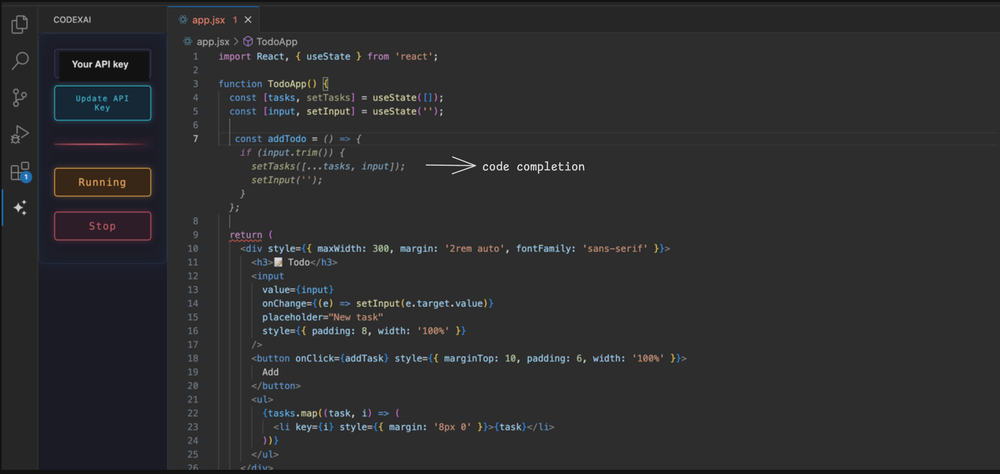
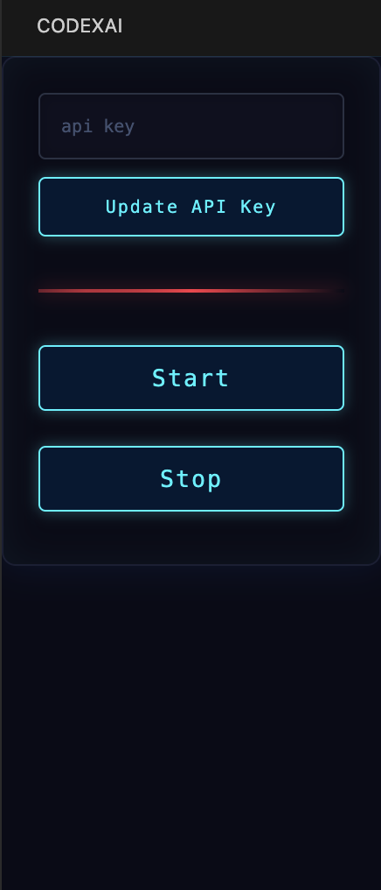
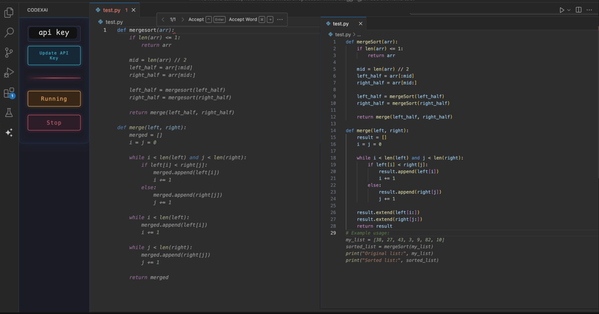

# Codex-AI: Intelligent Code Completion Powered by Gemini

Codex-AI is a lightweight VS Code extension that delivers AI-powered code completions through Google's Gemini API. Enjoy context-aware suggestions in any programming language with seamless tab-to-accept functionality.

 <!-- Add main interface screenshot here -->

## Features ✨

- **Universal Language Support** - Works with all programming languages
- **Instant Activation** - Simple one-click setup
- **Sidebar Integration** - Easy API key management
- **Ghost Text Preview** - Non-obstructive suggestions
- **Free Forever** - No subscriptions, only API key required

## Installation ⚙️

1. Install from [VS Code Marketplace](https://marketplace.visualstudio.com/items?itemName=MohammedAbdulRaffay.code-completer)
2. Configure through sidebar (see below)

## Getting Started 🚀

### 1. Set Up API Key
1. Open Codex-AI sidebar
2. Enter your Gemini API key
3. Click **Start**
4. To stop the extension click **Stop**

 

### 2. Start Coding
1. Begin typing in any supported language
2. View ghost text suggestions
3. Press `Tab` to accept completions
4. If you're not satisfied with the suggestion or want a different one, press `⌘+m` (Mac) or `Ctrl+m` (Windows/Linux) to request a new completion.

**Python Example**  
 

**Works for all the other languages as well like C , C++ , JAVA , Javascript ,  PHP etc**

## Configuration 🔧

The extension requires minimal setup:
1. Go to Google AI Studio [Google AI Studio](https://ai.google.dev/)
2. Sign in with your Google account.
3. Once you're in, head to the [API key page](https://aistudio.google.com/app/apikey)
4. Click "Create API Key" and copy it somewhere safe.
5. Enter key in sidebar input
6. Click **Start** to activate

The extension will automatically:
- Validate API credentials
- Initialize completion engine
- Start providing suggestions

## Privacy Assurance 🔒

- API keys stored locally in VS Code secure storage
- Zero data collection or tracking
- All requests encrypted via HTTPS
- No code context stored or shared

---

**Transform your coding workflow**  
Activate AI-powered development in under 1 minute - no complex settings or subscriptions required!